# DevSecOps Pipeline for Angular Applications

## Overview

This guide provides a comprehensive DevSecOps pipeline implementation for Angular applications using GitHub Actions. The pipeline integrates security at every stage of the development lifecycle.

## Pipeline Architecture

```mermaid
flowchart TB
    Start([Developer Push/PR]) --> Checkout[Checkout Code]

    Checkout --> SecretScan[Secret Scanning]
    SecretScan --> |Gitleaks/GitGuardian| SecretCheck{Secrets Found?}
    SecretCheck --> |Yes| Fail1[❌ Pipeline Fails]
    SecretCheck --> |No| Parallel

    Parallel --> Lint[Linting]
    Parallel --> SAST[SAST Analysis]
    Parallel --> Deps[Dependency Check]

    Lint --> |ESLint| LintCheck{Issues?}
    LintCheck --> |Critical| Fail2[❌ Pipeline Fails]
    LintCheck --> |Pass| UnitTest

    SAST --> |SonarCloud| SASTCheck{Vulnerabilities?}
    SASTCheck --> |Critical| Fail3[❌ Pipeline Fails]
    SASTCheck --> |Pass| UnitTest

    Deps --> |Snyk/npm audit| DepsCheck{Vulnerabilities?}
    DepsCheck --> |High/Critical| Fail4[❌ Pipeline Fails]
    DepsCheck --> |Pass| UnitTest

    UnitTest[Unit Tests] --> Coverage{Coverage > 80%?}
    Coverage --> |No| Fail5[❌ Pipeline Fails]
    Coverage --> |Yes| Build

    Build[Build Application] --> BuildCheck{Build Success?}
    BuildCheck --> |No| Fail6[❌ Pipeline Fails]
    BuildCheck --> |Yes| E2E

    E2E[E2E Tests] --> E2ECheck{Tests Pass?}
    E2ECheck --> |No| Fail7[❌ Pipeline Fails]
    E2ECheck --> |Yes| ContainerBuild

    ContainerBuild[Build Docker Image] --> ContainerScan[Container Scanning]
    ContainerScan --> |Trivy| ContainerCheck{Vulnerabilities?}
    ContainerCheck --> |Critical/High| Fail8[❌ Pipeline Fails]
    ContainerCheck --> |Pass| Release

    Release[Semantic Release] --> Deploy{Deploy to Env?}
    Deploy --> |Dev| DevEnv[Deploy to Dev]
    Deploy --> |Staging| StagingEnv[Deploy to Staging]
    Deploy --> |Prod| ProdEnv[Deploy to Production]

    DevEnv --> Monitor[Monitoring & Alerting]
    StagingEnv --> Monitor
    ProdEnv --> Monitor

    Monitor --> End([✅ Pipeline Complete])

    style Fail1 fill:#ff6b6b
    style Fail2 fill:#ff6b6b
    style Fail3 fill:#ff6b6b
    style Fail4 fill:#ff6b6b
    style Fail5 fill:#ff6b6b
    style Fail6 fill:#ff6b6b
    style Fail7 fill:#ff6b6b
    style Fail8 fill:#ff6b6b
    style End fill:#51cf66
    style Monitor fill:#4dabf7
```



## Pipeline Stages

### 1. Source Code Management

```yaml
# .github/workflows/angular-ci-cd.yml
name: Angular CI/CD Pipeline

on:
  push:
    branches: [main, develop]
  pull_request:
    branches: [main, develop]

permissions:
  contents: read
  security-events: write
  pull-requests: write
```

### 2. Secret Scanning

**Stage Purpose**: Detect hardcoded secrets, API keys, and credentials before they reach the repository.

```yaml
jobs:
  secret-scan:
    name: Secret Scanning
    uses: ./.github/workflows/gitleaks-secret-scan.yml

  gitguardian-scan:
    name: GitGuardian Scan
    uses: ./.github/workflows/gitguardian-secret-scan.yml
    secrets:
      GITGUARDIAN_API_KEY: ${{ secrets.GITGUARDIAN_API_KEY }}
```

**Tools Used**:
- **Gitleaks**: Fast, open-source secret scanner
- **GitGuardian**: Advanced secret detection with historical scanning

**What It Detects**:
- AWS credentials
- API keys (Google, Stripe, etc.)
- Private keys (SSH, GPG)
- Database connection strings
- OAuth tokens

### 3. Code Quality & Linting

**Stage Purpose**: Enforce code standards and identify potential bugs early.

```yaml
  lint:
    name: Lint Code
    needs: [secret-scan]
    uses: ./.github/workflows/angular-lint-app.yml
    with:
      node_version: "['20.x', '22.x']"
```

**Configuration** (`angular.json` or `.eslintrc.json`):
```json
{
  "extends": [
    "eslint:recommended",
    "@angular-eslint/recommended",
    "plugin:@typescript-eslint/recommended",
    "plugin:@angular-eslint/template/process-inline-templates"
  ],
  "rules": {
    "no-console": "error",
    "@typescript-eslint/no-explicit-any": "error",
    "@angular-eslint/component-selector": ["error", {
      "type": "element",
      "prefix": "app",
      "style": "kebab-case"
    }]
  }
}
```

### 4. Static Application Security Testing (SAST)

**Stage Purpose**: Analyze source code for security vulnerabilities without executing it.

```yaml
  sast-analysis:
    name: SAST - SonarCloud
    needs: [secret-scan]
    uses: ./.github/workflows/sonar-cloud-static-code-analysis.yml
    with:
      project_base_directory: my-angular-app
      source_folder: src/
    secrets:
      SONAR_TOKEN: ${{ secrets.SONAR_TOKEN }}
      SONAR_ORGANIZATION: ${{ secrets.SONAR_ORGANIZATION }}
      SONAR_URL: ${{ secrets.SONAR_URL }}
      SONAR_PROJECT_KEY: ${{ secrets.SONAR_PROJECT_KEY }}
```

**What It Detects**:
- SQL Injection vulnerabilities
- XSS (Cross-Site Scripting)
- Insecure data storage
- Weak cryptography
- Code smells and technical debt

**SonarCloud Quality Gates**:
```yaml
# sonar-project.properties
sonar.projectKey=my-org_my-angular-app
sonar.organization=my-org
sonar.sources=src
sonar.tests=src
sonar.test.inclusions=**/*.spec.ts
sonar.typescript.lcov.reportPaths=coverage/lcov.info
sonar.qualitygate.wait=true

# Quality Gate Conditions
sonar.qualitygate.coverage.minCoverage=80
sonar.qualitygate.duplicatedLinesDensity.maxDuplicatedLinesDensity=3.0
```

### 5. Dependency Vulnerability Scanning

**Stage Purpose**: Identify known vulnerabilities in third-party dependencies.

```yaml
  dependency-check:
    name: Dependency Analysis
    needs: [secret-scan]
    uses: ./.github/workflows/nodejs-dependency-analysis.yml
    with:
      node_version: "['22.x']"
    secrets:
      SNYK_TOKEN: ${{ secrets.SNYK_TOKEN }}
```

**Tools & Commands**:
```bash
# Snyk scan
snyk test --severity-threshold=high --json

# npm audit
npm audit --audit-level=high

# Generate SBOM (Software Bill of Materials)
npm sbom --output-format=cyclonedx
```

**Common Vulnerabilities to Watch**:
- Prototype pollution
- Regular expression DoS (ReDoS)
- Path traversal
- Command injection in dependencies

### 6. Unit Testing

**Stage Purpose**: Verify individual components and services function correctly with security considerations.

```yaml
  unit-test:
    name: Unit Tests
    needs: [lint, sast-analysis, dependency-check]
    uses: ./.github/workflows/angular-unit-test-app.yml
    with:
      node_version: "['22.x']"
```

**Security-Focused Unit Tests**:
```typescript
// Example: Testing XSS prevention
describe('MessageComponent', () => {
  it('should sanitize user input to prevent XSS', () => {
    const maliciousInput = '<script>alert("XSS")</script>';
    component.message = maliciousInput;
    fixture.detectChanges();

    const element = fixture.nativeElement.querySelector('.message');
    expect(element.innerHTML).not.toContain('<script>');
  });

  it('should validate API responses before rendering', () => {
    const untrustedData = { html: '' };
    expect(() => component.renderData(untrustedData))
      .toThrow('Invalid or unsafe content');
  });
});
```

**Coverage Requirements**:
```json
// karma.conf.js
coverageReporter: {
  type: 'lcov',
  dir: require('path').join(__dirname, './coverage'),
  check: {
    global: {
      statements: 80,
      branches: 80,
      functions: 80,
      lines: 80
    }
  }
}
```

### 7. Build

**Stage Purpose**: Compile and optimize the application for production.

```yaml
  build:
    name: Build Application
    needs: [unit-test]
    uses: ./.github/workflows/angular-build-app.yml
    with:
      node_version: "['22.x']"
```

**Secure Build Configuration** (`angular.json`):
```json
{
  "production": {
    "optimization": true,
    "outputHashing": "all",
    "sourceMap": false,
    "namedChunks": false,
    "extractLicenses": true,
    "vendorChunk": false,
    "buildOptimizer": true,
    "budgets": [
      {
        "type": "initial",
        "maximumWarning": "2mb",
        "maximumError": "5mb"
      }
    ],
    "fileReplacements": [{
      "replace": "src/environments/environment.ts",
      "with": "src/environments/environment.prod.ts"
    }],
    "securityHeaders": {
      "contentSecurityPolicy": "default-src 'self'; script-src 'self'",
      "xFrameOptions": "DENY",
      "xContentTypeOptions": "nosniff"
    }
  }
}
```

### 8. End-to-End (E2E) Testing

**Stage Purpose**: Test complete user workflows including security scenarios.

```yaml
  e2e-test:
    name: E2E Tests
    needs: [build]
    uses: ./.github/workflows/angular-cypress-e2e-test-app.yml
    with:
      node_version: "['22.x']"
```

**Security E2E Tests** (Cypress):
```typescript
// cypress/e2e/security.cy.ts
describe('Security Tests', () => {
  it('should prevent unauthorized access to admin routes', () => {
    cy.visit('/admin');
    cy.url().should('include', '/login');
    cy.contains('Unauthorized');
  });

  it('should implement CSRF protection', () => {
    cy.getCookie('XSRF-TOKEN').should('exist');
    cy.request({
      method: 'POST',
      url: '/api/data',
      failOnStatusCode: false,
      headers: {
        'X-XSRF-TOKEN': '' // Missing token
      }
    }).then((response) => {
      expect(response.status).to.eq(403);
    });
  });

  it('should sanitize user inputs', () => {
    cy.get('#user-input').type('');
    cy.get('#submit').click();
    cy.get('.output').should('not.contain', ' {
    cy.login();
    cy.clock();
    cy.tick(1800000); // 30 minutes
    cy.visit('/dashboard');
    cy.url().should('include', '/login');
  });
});
```

### 9. Container Security

**Stage Purpose**: Build secure container images and scan for vulnerabilities.

```yaml
  container-security:
    name: Container Build & Scan
    needs: [e2e-test]
    runs-on: ubuntu-latest
    steps:
      - uses: actions/checkout@v4

      - name: Build Docker Image
        run: docker build -t my-angular-app:${{ github.sha }} .

      - name: Trivy Vulnerability Scan
        uses: aquasecurity/trivy-action@master
        with:
          image-ref: my-angular-app:${{ github.sha }}
          format: 'sarif'
          output: 'trivy-results.sarif'
          severity: 'CRITICAL,HIGH'
          exit-code: '1'

      - name: Upload Trivy Results to GitHub Security
        uses: github/codeql-action/upload-sarif@v3
        if: always()
        with:
          sarif_file: 'trivy-results.sarif'
```

**Secure Dockerfile**:
```dockerfile
# Multi-stage build for security
FROM node:22-alpine AS builder

# Add security labels
LABEL maintainer="security@example.com"
LABEL security.scan="trivy"

# Create non-root user
RUN addgroup -g 1001 -S appuser && \
    adduser -u 1001 -S appuser -G appuser

WORKDIR /app

# Copy dependency files first (better caching)
COPY package*.json ./

# Install dependencies with audit
RUN npm ci --only=production && \
    npm audit fix --audit-level=high

# Copy source code
COPY . .

# Build application
RUN npm run build

# Production stage
FROM nginx:alpine

# Install security updates
RUN apk update && \
    apk upgrade && \
    apk add --no-cache curl && \
    rm -rf /var/cache/apk/*

# Copy built app
COPY --from=builder /app/dist/my-app /usr/share/nginx/html

# Copy secure nginx config
COPY nginx.conf /etc/nginx/nginx.conf

# Remove default nginx files
RUN rm -rf /usr/share/nginx/html/index.html

# Use non-root user
RUN chown -R nginx:nginx /usr/share/nginx/html && \
    chown -R nginx:nginx /var/cache/nginx && \
    chown -R nginx:nginx /var/log/nginx && \
    chown -R nginx:nginx /etc/nginx/conf.d

USER nginx

# Health check
HEALTHCHECK --interval=30s --timeout=3s \
  CMD curl -f http://localhost/ || exit 1

EXPOSE 8080

CMD ["nginx", "-g", "daemon off;"]
```

**Secure nginx.conf**:
```nginx
server {
    listen 8080;
    server_name _;

    root /usr/share/nginx/html;
    index index.html;

    # Security headers
    add_header X-Frame-Options "DENY" always;
    add_header X-Content-Type-Options "nosniff" always;
    add_header X-XSS-Protection "1; mode=block" always;
    add_header Referrer-Policy "strict-origin-when-cross-origin" always;
    add_header Content-Security-Policy "default-src 'self'; script-src 'self'; style-src 'self' 'unsafe-inline'; img-src 'self' data: https:; font-src 'self' data:; connect-src 'self' https://api.example.com;" always;
    add_header Permissions-Policy "geolocation=(), microphone=(), camera=()" always;

    # Hide nginx version
    server_tokens off;

    location / {
        try_files $uri $uri/ /index.html;
    }

    # Prevent access to hidden files
    location ~ /\. {
        deny all;
        access_log off;
        log_not_found off;
    }
}
```

### 10. Semantic Release & Deployment

**Stage Purpose**: Automate versioning and deployment with security checks.

```yaml
  release:
    name: Semantic Release
    needs: [container-security]
    if: github.ref == 'refs/heads/main'
    uses: ./.github/workflows/nodejs-semantic-release.yml
    with:
      node_version: "['22.x']"

  deploy-production:
    name: Deploy to Production
    needs: [release]
    uses: ./.github/workflows/docker-buildx-scan-and-publish.yml
    with:
      image_name: my-angular-app
      tag: ${{ needs.release.outputs.pkg-version }}
    secrets:
      DOCKER_USERNAME: ${{ secrets.DOCKER_USERNAME }}
      DOCKER_PASSWORD: ${{ secrets.DOCKER_PASSWORD }}
```

## Security Best Practices

### 1. Environment Variables

**Never commit secrets**. Use GitHub Secrets:

```yaml
# Access secrets in workflows
env:
  API_KEY: ${{ secrets.API_KEY }}
  DATABASE_URL: ${{ secrets.DATABASE_URL }}
```

**Angular Environment Configuration**:
```typescript
// src/environments/environment.prod.ts
export const environment = {
  production: true,
  apiUrl: 'https://api.example.com', // Public URL only
  // Never hardcode secrets here
};
```

### 2. Content Security Policy (CSP)

Implement CSP headers to prevent XSS:

```typescript
// app.module.ts
import { CSP_NONCE } from '@angular/platform-browser';

@NgModule({
  providers: [
    {
      provide: CSP_NONCE,
      useValue: globalThis.cspNonce
    }
  ]
})
```

### 3. Dependency Management

```json
// package.json
{
  "scripts": {
    "preinstall": "npx npm-force-resolutions",
    "audit": "npm audit --audit-level=moderate",
    "audit:fix": "npm audit fix"
  },
  "resolutions": {
    "**/vulnerable-package": "^2.0.0"
  }
}
```

### 4. Authentication & Authorization

```typescript
// auth.guard.ts
import { inject } from '@angular/core';
import { Router } from '@angular/router';
import { AuthService } from './auth.service';

export const authGuard = () => {
  const authService = inject(AuthService);
  const router = inject(Router);

  if (authService.isAuthenticated()) {
    return true;
  }

  return router.parseUrl('/login');
};
```

## Monitoring & Compliance

### Runtime Application Self-Protection (RASP)

```typescript
// main.ts - Add error monitoring
import * as Sentry from '@sentry/angular';

Sentry.init({
  dsn: 'https://your-dsn@sentry.io/project',
  integrations: [
    new Sentry.BrowserTracing(),
    new Sentry.Replay()
  ],
  tracesSampleRate: 1.0,
  replaysSessionSampleRate: 0.1,
  replaysOnErrorSampleRate: 1.0,
});
```

### Security Metrics Dashboard

Track these KPIs:
- ✅ Time to detect vulnerabilities
- ✅ Time to remediate critical issues
- ✅ Number of security issues per release
- ✅ Code coverage percentage
- ✅ Dependency freshness score

## Complete Pipeline Example

```yaml
# .github/workflows/angular-devsecops.yml
name: Angular DevSecOps Pipeline

on:
  push:
    branches: [main, develop]
  pull_request:
    branches: [main]

permissions:
  contents: write
  security-events: write
  pull-requests: write

jobs:
  secret-scan:
    name: 🔐 Secret Scanning
    uses: ./.github/workflows/gitleaks-secret-scan.yml

  parallel-checks:
    name: Parallel Security Checks
    needs: [secret-scan]
    strategy:
      matrix:
        check: [lint, sast, dependency]
    runs-on: ubuntu-latest
    steps:
      - uses: actions/checkout@v4

      - name: Setup Node.js
        uses: actions/setup-node@v4
        with:
          node-version: '22.x'
          cache: 'npm'

      - run: npm ci

      - name: Run Check
        run: |
          case "${{ matrix.check }}" in
            lint) npm run lint ;;
            sast) npm run sonar ;;
            dependency) npm audit --audit-level=high ;;
          esac

  test:
    name: 🧪 Unit & Integration Tests
    needs: [parallel-checks]
    uses: ./.github/workflows/angular-unit-test-app.yml
    with:
      node_version: "['22.x']"

  build:
    name: 🏗️ Build Application
    needs: [test]
    uses: ./.github/workflows/angular-build-app.yml
    with:
      node_version: "['22.x']"

  e2e:
    name: 🎭 E2E Security Tests
    needs: [build]
    uses: ./.github/workflows/angular-cypress-e2e-test-app.yml
    with:
      node_version: "['22.x']"

  container-scan:
    name: 🐳 Container Security
    needs: [e2e]
    uses: ./.github/workflows/docker-buildx-scan-and-publish.yml
    if: github.ref == 'refs/heads/main'
    with:
      image_name: my-angular-app
      tag: latest
    secrets:
      DOCKER_USERNAME: ${{ secrets.DOCKER_USERNAME }}
      DOCKER_PASSWORD: ${{ secrets.DOCKER_PASSWORD }}

  release:
    name: 🚀 Release
    needs: [container-scan]
    uses: ./.github/workflows/nodejs-semantic-release.yml
    if: github.ref == 'refs/heads/main'
    with:
      node_version: "['22.x']"
```

## Conclusion

This DevSecOps pipeline ensures:
- ✅ Automated security scanning at every stage
- ✅ Early detection of vulnerabilities
- ✅ Compliance with security standards
- ✅ Fast feedback loops for developers
- ✅ Secure containerization and deployment
- ✅ Continuous monitoring and improvement

**Next Steps**:
1. Customize the pipeline for your specific requirements
2. Configure quality gates and thresholds
3. Set up monitoring and alerting
4. Train team on security best practices
5. Regular security audits and updates
