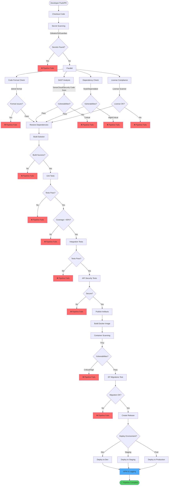

# DevSecOps Pipeline for .NET Web APIs

## Overview

This comprehensive guide provides a DevSecOps pipeline implementation for .NET Web APIs using GitHub Actions. The pipeline integrates security testing, static code analysis, and automated deployment with a focus on .NET-specific security concerns.

## Pipeline Architecture



## Pipeline Stages

### 1. Source Code Management

```yaml
# .github/workflows/dotnet-ci-cd.yml
name: .NET Web API DevSecOps Pipeline

on:
  push:
    branches: [main, develop]
  pull_request:
    branches: [main, develop]

env:
  DOTNET_VERSION: '8.0.x'
  SOLUTION_FILE: 'MyWebApi.sln'
  PROJECT_PATH: 'src/MyWebApi'

permissions:
  contents: read
  security-events: write
  pull-requests: write
  id-token: write
```

### 2. Secret Scanning

**Stage Purpose**: Detect hardcoded secrets, connection strings, and credentials.

```yaml
jobs:
  secret-scan:
    name: 🔐 Secret Scanning
    runs-on: ubuntu-latest
    steps:
      - name: Checkout code
        uses: actions/checkout@v4
        with:
          fetch-depth: 0

      - name: Gitleaks Scan
        uses: gitleaks/gitleaks-action@v2
        env:
          GITHUB_TOKEN: ${{ secrets.GITHUB_TOKEN }}

      - name: GitGuardian Scan
        uses: GitGuardian/ggshield/actions/secret@v1.33.0
        env:
          GITGUARDIAN_API_KEY: ${{ secrets.GITGUARDIAN_API_KEY }}
```

**Critical Secrets for .NET**:
- SQL Server connection strings
- Azure Storage account keys
- OAuth client secrets
- API keys (SendGrid, Twilio, etc.)
- JWT signing keys
- Azure AD credentials

### 3. Code Formatting & Style

**Stage Purpose**: Enforce consistent code style and .NET conventions.

```yaml
  code-format:
    name: 📝 Code Format Check
    needs: [secret-scan]
    runs-on: ubuntu-latest
    steps:
      - uses: actions/checkout@v4

      - name: Setup .NET
        uses: actions/setup-dotnet@v4
        with:
          dotnet-version: ${{ env.DOTNET_VERSION }}

      - name: Restore dependencies
        run: dotnet restore ${{ env.SOLUTION_FILE }}

      - name: Format check
        run: dotnet format ${{ env.SOLUTION_FILE }} --verify-no-changes --verbosity diagnostic

      - name: Install dotnet-format
        run: dotnet tool install -g dotnet-format

      - name: Run StyleCop
        run: dotnet build ${{ env.SOLUTION_FILE }} /p:EnforceCodeStyleInBuild=true
```

**.editorconfig for Security**:
```ini
root = true

[*.cs]
# Require 'this' for clarity
dotnet_style_qualification_for_field = true:suggestion
dotnet_style_qualification_for_property = true:suggestion

# Prefer explicit types for security-critical code
csharp_style_var_for_built_in_types = false:suggestion
csharp_style_var_when_type_is_apparent = true:suggestion
csharp_style_var_elsewhere = false:suggestion

# Require braces
csharp_prefer_braces = true:warning

# Null checking
csharp_style_throw_expression = true:suggestion
csharp_style_conditional_delegate_call = true:suggestion

# Security analyzers
dotnet_diagnostic.CA2100.severity = error  # SQL injection
dotnet_diagnostic.CA3075.severity = error  # Insecure DTD processing
dotnet_diagnostic.CA3076.severity = error  # Insecure XSLT
dotnet_diagnostic.CA3147.severity = error  # Validate anti-forgery token
dotnet_diagnostic.CA5350.severity = error  # Do not use weak crypto
dotnet_diagnostic.CA5351.severity = error  # Do not use broken crypto
```

### 4. Static Application Security Testing (SAST)

**Stage Purpose**: Analyze .NET code for security vulnerabilities.

```yaml
  sast:
    name: 🔍 SAST Analysis
    needs: [secret-scan]
    runs-on: windows-latest
    steps:
      - uses: actions/checkout@v4
        with:
          fetch-depth: 0

      - name: Setup .NET
        uses: actions/setup-dotnet@v4
        with:
          dotnet-version: ${{ env.DOTNET_VERSION }}

      - name: Cache SonarCloud packages
        uses: actions/cache@v4
        with:
          path: ~\sonar\cache
          key: ${{ runner.os }}-sonar
          restore-keys: ${{ runner.os }}-sonar

      - name: Install SonarScanner
        run: dotnet tool install --global dotnet-sonarscanner

      - name: Restore dependencies
        run: dotnet restore ${{ env.SOLUTION_FILE }}

      - name: Begin SonarCloud analysis
        run: |
          dotnet sonarscanner begin `
            /k:"${{ secrets.SONAR_PROJECT_KEY }}" `
            /o:"${{ secrets.SONAR_ORGANIZATION }}" `
            /d:sonar.login="${{ secrets.SONAR_TOKEN }}" `
            /d:sonar.host.url="https://sonarcloud.io" `
            /d:sonar.cs.opencover.reportsPaths="**/coverage.opencover.xml" `
            /d:sonar.cs.vstest.reportsPaths="**/*.trx"

      - name: Build solution
        run: dotnet build ${{ env.SOLUTION_FILE }} --no-restore

      - name: Run tests with coverage
        run: |
          dotnet test ${{ env.SOLUTION_FILE }} `
            --no-build `
            --logger "trx;LogFileName=test-results.trx" `
            /p:CollectCoverage=true `
            /p:CoverletOutputFormat=opencover `
            /p:CoverletOutput=coverage.opencover.xml

      - name: End SonarCloud analysis
        run: dotnet sonarscanner end /d:sonar.login="${{ secrets.SONAR_TOKEN }}"
        env:
          GITHUB_TOKEN: ${{ secrets.GITHUB_TOKEN }}

      - name: Security Code Scan
        run: |
          dotnet tool install --global security-scan
          security-scan ${{ env.SOLUTION_FILE }}
```

**Security Rules in .csproj**:
```xml
<Project Sdk="Microsoft.NET.Sdk.Web">
  <PropertyGroup>
    <TargetFramework>net8.0</TargetFramework>
    <Nullable>enable</Nullable>
    <TreatWarningsAsErrors>true</TreatWarningsAsErrors>
    <EnforceCodeStyleInBuild>true</EnforceCodeStyleInBuild>
    <EnableNETAnalyzers>true</EnableNETAnalyzers>
    <AnalysisLevel>latest</AnalysisLevel>
  </PropertyGroup>

  <ItemGroup>
    <!-- Security analyzers -->
    <PackageReference Include="Microsoft.CodeAnalysis.NetAnalyzers" Version="8.0.0">
      <PrivateAssets>all</PrivateAssets>
      <IncludeAssets>runtime; build; native; contentfiles; analyzers</IncludeAssets>
    </PackageReference>
    <PackageReference Include="SecurityCodeScan.VS2019" Version="5.6.7">
      <PrivateAssets>all</PrivateAssets>
      <IncludeAssets>runtime; build; native; contentfiles; analyzers</IncludeAssets>
    </PackageReference>
    <PackageReference Include="SonarAnalyzer.CSharp" Version="9.31.0.96804">
      <PrivateAssets>all</PrivateAssets>
      <IncludeAssets>runtime; build; native; contentfiles; analyzers</IncludeAssets>
    </PackageReference>
  </ItemGroup>
</Project>
```

### 5. Dependency Vulnerability Scanning

**Stage Purpose**: Identify vulnerabilities in NuGet packages.

```yaml
  dependency-scan:
    name: 📦 Dependency Security Scan
    needs: [secret-scan]
    runs-on: ubuntu-latest
    steps:
      - uses: actions/checkout@v4

      - name: Setup .NET
        uses: actions/setup-dotnet@v4
        with:
          dotnet-version: ${{ env.DOTNET_VERSION }}

      - name: Restore dependencies
        run: dotnet restore ${{ env.SOLUTION_FILE }}

      - name: Snyk Security Scan
        uses: snyk/actions/dotnet@master
        env:
          SNYK_TOKEN: ${{ secrets.SNYK_TOKEN }}
        with:
          args: --severity-threshold=high --fail-on=all

      - name: dotnet list package vulnerabilities
        run: |
          dotnet list package --vulnerable --include-transitive 2>&1 | tee vulnerable-packages.txt
          if grep -q "has the following vulnerable packages" vulnerable-packages.txt; then
            echo "Vulnerable packages found!"
            exit 1
          fi

      - name: Generate SBOM
        run: |
          dotnet tool install --global CycloneDX
          dotnet CycloneDX ${{ env.SOLUTION_FILE }} -o . -f sbom.json

      - name: Upload SBOM
        uses: actions/upload-artifact@v4
        with:
          name: sbom
          path: sbom.json
```

### 6. Build & Compile

**Stage Purpose**: Build the application with security optimizations.

```yaml
  build:
    name: 🏗️ Build Application
    needs: [code-format, sast, dependency-scan]
    runs-on: ubuntu-latest
    steps:
      - uses: actions/checkout@v4

      - name: Setup .NET
        uses: actions/setup-dotnet@v4
        with:
          dotnet-version: ${{ env.DOTNET_VERSION }}

      - name: Restore dependencies
        run: dotnet restore ${{ env.SOLUTION_FILE }}

      - name: Build
        run: |
          dotnet build ${{ env.SOLUTION_FILE }} \
            --configuration Release \
            --no-restore \
            /p:TreatWarningsAsErrors=true \
            /p:Deterministic=true \
            /p:ContinuousIntegrationBuild=true

      - name: Publish
        run: |
          dotnet publish ${{ env.PROJECT_PATH }} \
            --configuration Release \
            --no-build \
            --output ./publish \
            /p:PublishTrimmed=false \
            /p:PublishSingleFile=false

      - name: Upload build artifacts
        uses: actions/upload-artifact@v4
        with:
          name: dotnet-app
          path: ./publish
          retention-days: 7
```

### 7. Unit Testing with Security Focus

**Stage Purpose**: Verify business logic and security controls.

```yaml
  unit-test:
    name: 🧪 Unit Tests
    needs: [build]
    runs-on: ubuntu-latest
    steps:
      - uses: actions/checkout@v4

      - name: Setup .NET
        uses: actions/setup-dotnet@v4
        with:
          dotnet-version: ${{ env.DOTNET_VERSION }}

      - name: Restore dependencies
        run: dotnet restore ${{ env.SOLUTION_FILE }}

      - name: Run unit tests
        run: |
          dotnet test ${{ env.SOLUTION_FILE }} \
            --configuration Release \
            --no-restore \
            --logger "trx;LogFileName=test-results.trx" \
            --logger "console;verbosity=detailed" \
            --collect:"XPlat Code Coverage" \
            -- DataCollectionRunSettings.DataCollectors.DataCollector.Configuration.Format=opencover

      - name: Code Coverage Report
        uses: codecov/codecov-action@v4
        with:
          files: '**/coverage.opencover.xml'
          fail_ci_if_error: true

      - name: Check Coverage Threshold
        run: |
          dotnet tool install -g dotnet-reportgenerator-globaltool
          reportgenerator -reports:**/coverage.opencover.xml -targetdir:./coverage -reporttypes:TextSummary
          COVERAGE=$(grep "Line coverage:" ./coverage/Summary.txt | grep -oP '\d+\.\d+')
          echo "Coverage: $COVERAGE%"
          if (( $(echo "$COVERAGE < 80" | bc -l) )); then
            echo "Coverage is below 80%"
            exit 1
          fi
```

**Security-Focused Unit Tests**:
```csharp
// AuthenticationTests.cs
using Xunit;
using FluentAssertions;
using Microsoft.AspNetCore.Identity;

public class AuthenticationTests
{
    [Fact]
    public async Task HashPassword_ShouldUseSecureAlgorithm()
    {
        // Arrange
        var hasher = new PasswordHasher<User>();
        var password = "SecureP@ssw0rd123";

        // Act
        var hashedPassword = hasher.HashPassword(null, password);

        // Assert
        hashedPassword.Should().NotBe(password);
        hashedPassword.Should().StartWith("AQA"); // PBKDF2 with HMAC-SHA256
    }

    [Fact]
    public async Task VerifyPassword_ShouldPreventTimingAttacks()
    {
        // Arrange
        var hasher = new PasswordHasher<User>();
        var correctPassword = "correct";
        var hash = hasher.HashPassword(null, correctPassword);

        // Act
        var sw1 = Stopwatch.StartNew();
        hasher.VerifyHashedPassword(null, hash, "wrong");
        sw1.Stop();

        var sw2 = Stopwatch.StartNew();
        hasher.VerifyHashedPassword(null, hash, correctPassword);
        sw2.Stop();

        // Assert - timing should be similar (within 50ms)
        var timeDiff = Math.Abs(sw1.ElapsedMilliseconds - sw2.ElapsedMilliseconds);
        timeDiff.Should().BeLessThan(50);
    }

    [Theory]
    [InlineData("short")]
    [InlineData("nouppercaseornumber")]
    [InlineData("NOLOWERCASE123")]
    [InlineData("NoSpecialChar123")]
    public async Task ValidatePassword_ShouldRejectWeakPasswords(string weakPassword)
    {
        // Arrange
        var validator = new PasswordValidator();

        // Act
        var result = await validator.ValidateAsync(weakPassword);

        // Assert
        result.Succeeded.Should().BeFalse();
    }
}

// SqlInjectionTests.cs
public class SqlInjectionPreventionTests
{
    [Fact]
    public async Task GetUser_ShouldUseParameterizedQuery()
    {
        // Arrange
        var context = GetTestDbContext();
        var repository = new UserRepository(context);
        var maliciousInput = "'; DROP TABLE Users; --";

        // Act
        var result = await repository.GetUserByUsernameAsync(maliciousInput);

        // Assert
        result.Should().BeNull(); // Query returns null, doesn't execute injection

        // Verify Users table still exists
        var usersCount = await context.Users.CountAsync();
        usersCount.Should().BeGreaterThanOrEqual(0);
    }

    [Fact]
    public async Task SearchUsers_ShouldSanitizeInput()
    {
        // Arrange
        var searchTerm = "<script>alert('xss')</script>";
        var service = new UserService();

        // Act
        var results = await service.SearchUsersAsync(searchTerm);

        // Assert
        results.Should().BeEmpty(); // No matches for script tags
    }
}

// AuthorizationTests.cs
public class AuthorizationTests
{
    [Fact]
    public async Task AdminEndpoint_ShouldRequireAdminRole()
    {
        // Arrange
        var client = _factory.CreateClient();
        var userToken = await GetUserToken(); // Regular user token

        // Act
        var response = await client.GetAsync("/api/admin/users", req =>
            req.Headers.Authorization = new AuthenticationHeaderValue("Bearer", userToken));

        // Assert
        response.StatusCode.Should().Be(HttpStatusCode.Forbidden);
    }

    [Fact]
    public async Task UserData_ShouldOnlyBeAccessibleByOwner()
    {
        // Arrange
        var user1Token = await GetTokenForUser(1);
        var user2Id = 2;

        // Act
        var response = await _client.GetAsync($"/api/users/{user2Id}/profile", req =>
            req.Headers.Authorization = new AuthenticationHeaderValue("Bearer", user1Token));

        // Assert
        response.StatusCode.Should().Be(HttpStatusCode.Forbidden);
    }
}

// CryptographyTests.cs
public class CryptographyTests
{
    [Fact]
    public void EncryptData_ShouldUseAES256()
    {
        // Arrange
        var encryptionService = new EncryptionService();
        var plaintext = "Sensitive data";

        // Act
        var encrypted = encryptionService.Encrypt(plaintext);

        // Assert
        encrypted.Should().NotBe(plaintext);
        encryptionService.GetAlgorithm().Should().Be("AES-256-GCM");
    }

    [Fact]
    public void GenerateJwtSecret_ShouldUseSecureRandomGenerator()
    {
        // Arrange & Act
        var secret1 = JwtSecretGenerator.Generate();
        var secret2 = JwtSecretGenerator.Generate();

        // Assert
        secret1.Should().NotBe(secret2);
        secret1.Length.Should().BeGreaterThanOrEqual(64);

        // Should use cryptographically secure random generator
        var bytes = Convert.FromBase64String(secret1);
        bytes.Should().HaveCountGreaterThan(32);
    }
}
```

### 8. Integration Testing

**Stage Purpose**: Test API endpoints with database and external dependencies.

```yaml
  integration-test:
    name: 🔗 Integration Tests
    needs: [unit-test]
    runs-on: ubuntu-latest
    services:
      sqlserver:
        image: mcr.microsoft.com/mssql/server:2022-latest
        env:
          ACCEPT_EULA: Y
          SA_PASSWORD: SecureP@ssw0rd123
          MSSQL_PID: Developer
        ports:
          - 1433:1433
        options: >-
          --health-cmd="/opt/mssql-tools/bin/sqlcmd -S localhost -U sa -P SecureP@ssw0rd123 -Q 'SELECT 1'"
          --health-interval=10s
          --health-timeout=5s
          --health-retries=5

      redis:
        image: redis:7-alpine
        ports:
          - 6379:6379
        options: >-
          --health-cmd "redis-cli ping"
          --health-interval 10s

    steps:
      - uses: actions/checkout@v4

      - name: Setup .NET
        uses: actions/setup-dotnet@v4
        with:
          dotnet-version: ${{ env.DOTNET_VERSION }}

      - name: Restore dependencies
        run: dotnet restore ${{ env.SOLUTION_FILE }}

      - name: Apply EF Migrations
        run: |
          dotnet tool install --global dotnet-ef
          dotnet ef database update --project ${{ env.PROJECT_PATH }}
        env:
          ConnectionStrings__DefaultConnection: "Server=localhost,1433;Database=TestDb;User Id=sa;Password=SecureP@ssw0rd123;TrustServerCertificate=True;"

      - name: Run integration tests
        run: dotnet test **/*IntegrationTests.csproj --configuration Release
        env:
          ConnectionStrings__DefaultConnection: "Server=localhost,1433;Database=TestDb;User Id=sa;Password=SecureP@ssw0rd123;TrustServerCertificate=True;"
          ConnectionStrings__Redis: "localhost:6379"
```

**Integration Test Examples**:
```csharp
// AuthenticationIntegrationTests.cs
public class AuthenticationIntegrationTests : IClassFixture<WebApplicationFactory<Program>>
{
    private readonly HttpClient _client;

    [Fact]
    public async Task Register_WithStrongPassword_ShouldSucceed()
    {
        // Arrange
        var request = new RegisterRequest
        {
            Email = "test@example.com",
            Password = "SecureP@ssw0rd123",
            ConfirmPassword = "SecureP@ssw0rd123"
        };

        // Act
        var response = await _client.PostAsJsonAsync("/api/auth/register", request);

        // Assert
        response.StatusCode.Should().Be(HttpStatusCode.Created);
        var result = await response.Content.ReadFromJsonAsync<AuthResponse>();
        result.Token.Should().NotBeNullOrEmpty();
    }

    [Fact]
    public async Task Login_WithRateLimiting_ShouldBlock()
    {
        // Arrange
        var loginRequest = new { Email = "test@example.com", Password = "wrong" };
        var tasks = new List<Task<HttpResponseMessage>>();

        // Act - Send 20 requests quickly
        for (int i = 0; i < 20; i++)
        {
            tasks.Add(_client.PostAsJsonAsync("/api/auth/login", loginRequest));
        }
        var responses = await Task.WhenAll(tasks);

        // Assert
        var tooManyRequests = responses.Count(r => r.StatusCode == HttpStatusCode.TooManyRequests);
        tooManyRequests.Should().BeGreaterThan(0);
    }

    [Fact]
    public async Task ProtectedEndpoint_WithoutToken_ShouldReturn401()
    {
        // Act
        var response = await _client.GetAsync("/api/users/me");

        // Assert
        response.StatusCode.Should().Be(HttpStatusCode.Unauthorized);
    }

    [Fact]
    public async Task ProtectedEndpoint_WithExpiredToken_ShouldReturn401()
    {
        // Arrange
        var expiredToken = GenerateExpiredToken();
        _client.DefaultRequestHeaders.Authorization =
            new AuthenticationHeaderValue("Bearer", expiredToken);

        // Act
        var response = await _client.GetAsync("/api/users/me");

        // Assert
        response.StatusCode.Should().Be(HttpStatusCode.Unauthorized);
    }

    [Fact]
    public async Task JwtToken_ShouldContainRequiredClaims()
    {
        // Arrange
        var loginResponse = await LoginAsUser();
        var token = loginResponse.Token;

        // Act
        var handler = new JwtSecurityTokenHandler();
        var jwtToken = handler.ReadJwtToken(token);

        // Assert
        jwtToken.Claims.Should().Contain(c => c.Type == ClaimTypes.NameIdentifier);
        jwtToken.Claims.Should().Contain(c => c.Type == ClaimTypes.Email);
        jwtToken.Claims.Should().Contain(c => c.Type == ClaimTypes.Role);

        var expClaim = jwtToken.Claims.First(c => c.Type == JwtRegisteredClaimNames.Exp);
        var expDate = DateTimeOffset.FromUnixTimeSeconds(long.Parse(expClaim.Value));
        expDate.Should().BeAfter(DateTimeOffset.UtcNow);
        expDate.Should().BeBefore(DateTimeOffset.UtcNow.AddHours(2)); // Max 2 hours
    }
}
```

### 9. API Security Testing (DAST)

```yaml
  api-security-test:
    name: 🛡️ API Security Testing (DAST)
    needs: [integration-test]
    runs-on: ubuntu-latest
    steps:
      - uses: actions/checkout@v4

      - name: Setup .NET
        uses: actions/setup-dotnet@v4
        with:
          dotnet-version: ${{ env.DOTNET_VERSION }}

      - name: Start API
        run: |
          dotnet run --project ${{ env.PROJECT_PATH }} &
          sleep 30
        env:
          ASPNETCORE_ENVIRONMENT: Development
          ASPNETCORE_URLS: http://localhost:5000

      - name: OWASP ZAP API Scan
        uses: zaproxy/action-api-scan@v0.7.0
        with:
          target: 'http://localhost:5000'
          format: openapi
          cmd_options: '-a -j'

      - name: Upload ZAP Results
        uses: actions/upload-artifact@v4
        if: always()
        with:
          name: zap-report
          path: report_html.html
```

### 10. Container Security

**Stage Purpose**: Build and scan Docker images for vulnerabilities.

```yaml
  container-security:
    name: 🐳 Container Build & Scan
    needs: [integration-test]
    runs-on: ubuntu-latest
    steps:
      - uses: actions/checkout@v4

      - name: Set up Docker Buildx
        uses: docker/setup-buildx-action@v3

      - name: Build Docker image
        uses: docker/build-push-action@v5
        with:
          context: .
          file: ./Dockerfile
          load: true
          tags: dotnet-api:${{ github.sha }}
          cache-from: type=gha
          cache-to: type=gha,mode=max

      - name: Trivy vulnerability scan
        uses: aquasecurity/trivy-action@master
        with:
          image-ref: dotnet-api:${{ github.sha }}
          format: 'sarif'
          output: 'trivy-results.sarif'
          severity: 'CRITICAL,HIGH'
          exit-code: '1'

      - name: Upload Trivy results to GitHub Security
        uses: github/codeql-action/upload-sarif@v3
        if: always()
        with:
          sarif_file: 'trivy-results.sarif'

      - name: Grype scan
        uses: anchore/scan-action@v3
        with:
          image: dotnet-api:${{ github.sha }}
          fail-build: true
          severity-cutoff: high
```

**Secure Dockerfile for .NET**:
```dockerfile
# Build stage
FROM mcr.microsoft.com/dotnet/sdk:8.0-alpine AS build
WORKDIR /src

# Copy csproj and restore
COPY ["src/MyWebApi/MyWebApi.csproj", "MyWebApi/"]
RUN dotnet restore "MyWebApi/MyWebApi.csproj"

# Copy everything else and build
COPY src/MyWebApi/. MyWebApi/
WORKDIR "/src/MyWebApi"
RUN dotnet build "MyWebApi.csproj" -c Release -o /app/build

# Publish stage
FROM build AS publish
RUN dotnet publish "MyWebApi.csproj" -c Release -o /app/publish /p:UseAppHost=false

# Runtime stage
FROM mcr.microsoft.com/dotnet/aspnet:8.0-alpine AS final

# Install security updates
RUN apk update && \
    apk upgrade && \
    apk add --no-cache curl && \
    rm -rf /var/cache/apk/*

# Create non-root user
RUN addgroup -g 1001 -S appuser && \
    adduser -u 1001 -S appuser -G appuser

WORKDIR /app

# Copy published app
COPY --from=publish --chown=appuser:appuser /app/publish .

# Set proper permissions
RUN chmod -R 555 /app && \
    chmod -R ugo+w /tmp

# Use non-root user
USER appuser

# Health check
HEALTHCHECK --interval=30s --timeout=3s --start-period=10s --retries=3 \
  CMD curl -f http://localhost:8080/health || exit 1

# Security: Don't expose port 80
EXPOSE 8080

# Set environment variables
ENV ASPNETCORE_URLS=http://+:8080 \
    ASPNETCORE_ENVIRONMENT=Production \
    DOTNET_SYSTEM_GLOBALIZATION_INVARIANT=false

ENTRYPOINT ["dotnet", "MyWebApi.dll"]
```

### 11. Database Migrations

```yaml
  ef-migrations:
    name: 🗄️ EF Core Migrations
    needs: [container-security]
    runs-on: ubuntu-latest
    services:
      sqlserver:
        image: mcr.microsoft.com/mssql/server:2022-latest
        env:
          ACCEPT_EULA: Y
          SA_PASSWORD: MigrationTest123!
        ports:
          - 1433:1433

    steps:
      - uses: actions/checkout@v4

      - name: Setup .NET
        uses: actions/setup-dotnet@v4
        with:
          dotnet-version: ${{ env.DOTNET_VERSION }}

      - name: Install EF Core tools
        run: dotnet tool install --global dotnet-ef

      - name: Create migration bundle
        run: |
          dotnet ef migrations bundle \
            --project ${{ env.PROJECT_PATH }} \
            --output ./efbundle \
            --self-contained \
            --runtime linux-x64

      - name: Apply migrations
        run: |
          ./efbundle \
            --connection "Server=localhost,1433;Database=MigrationTestDb;User Id=sa;Password=MigrationTest123!;TrustServerCertificate=True;"

      - name: Verify migrations
        run: |
          dotnet ef migrations list --project ${{ env.PROJECT_PATH }}
```

### 12. Release & Deployment

```yaml
  release:
    name: 🚀 Create Release
    needs: [ef-migrations]
    if: github.ref == 'refs/heads/main'
    runs-on: ubuntu-latest
    permissions:
      contents: write
    outputs:
      version: ${{ steps.gitversion.outputs.semVer }}
    steps:
      - uses: actions/checkout@v4
        with:
          fetch-depth: 0

      - name: Install GitVersion
        uses: gittools/actions/gitversion/setup@v1
        with:
          versionSpec: '5.x'

      - name: Determine Version
        id: gitversion
        uses: gittools/actions/gitversion/execute@v1

      - name: Create Release
        uses: actions/create-release@v1
        env:
          GITHUB_TOKEN: ${{ secrets.GITHUB_TOKEN }}
        with:
          tag_name: v${{ steps.gitversion.outputs.semVer }}
          release_name: Release v${{ steps.gitversion.outputs.semVer }}
          draft: false
          prerelease: false

  deploy:
    name: 🚢 Deploy to Production
    needs: [release]
    uses: ./.github/workflows/docker-buildx-scan-and-publish.yml
    with:
      image_name: my-dotnet-api
      tag: ${{ needs.release.outputs.version }}
    secrets:
      DOCKER_USERNAME: ${{ secrets.DOCKER_USERNAME }}
      DOCKER_PASSWORD: ${{ secrets.DOCKER_PASSWORD }}
```

## .NET Security Best Practices

### 1. Secure Configuration

```csharp
// Program.cs
var builder = WebApplication.CreateBuilder(args);

// Security configurations
builder.Services.AddControllers(options =>
{
    options.Filters.Add<ValidateModelStateAttribute>();
    options.Filters.Add<ValidateAntiForgeryTokenAttribute>();
});

// CORS
builder.Services.AddCors(options =>
{
    options.AddPolicy("AllowedOrigins", policy =>
    {
        policy.WithOrigins(builder.Configuration.GetSection("AllowedOrigins").Get<string[]>())
              .AllowedHeaders("Content-Type", "Authorization")
              .AllowedMethods("GET", "POST", "PUT", "DELETE")
              .AllowCredentials();
    });
});

// Authentication & Authorization
builder.Services.AddAuthentication(JwtBearerDefaults.AuthenticationScheme)
    .AddJwtBearer(options =>
    {
        options.TokenValidationParameters = new TokenValidationParameters
        {
            ValidateIssuer = true,
            ValidateAudience = true,
            ValidateLifetime = true,
            ValidateIssuerSigningKey = true,
            ValidIssuer = builder.Configuration["Jwt:Issuer"],
            ValidAudience = builder.Configuration["Jwt:Audience"],
            IssuerSigningKey = new SymmetricSecurityKey(
                Encoding.UTF8.GetBytes(builder.Configuration["Jwt:Key"])),
            ClockSkew = TimeSpan.Zero
        };
    });

builder.Services.AddAuthorization(options =>
{
    options.AddPolicy("AdminOnly", policy =>
        policy.RequireRole("Admin"));
    options.AddPolicy("RequireMFA", policy =>
        policy.RequireClaim("mfa", "true"));
});

var app = builder.Build();

// Security middleware
app.UseSecurityHeaders();
app.UseHsts();
app.UseHttpsRedirection();
app.UseCors("AllowedOrigins");
app.UseRateLimiter();
app.UseAuthentication();
app.UseAuthorization();

app.MapControllers();
app.Run();
```

### 2. Input Validation

```csharp
using System.ComponentModel.DataAnnotations;
using Microsoft.AspNetCore.Mvc;

public class CreateUserRequest
{
    [Required]
    [EmailAddress]
    [StringLength(100)]
    public string Email { get; set; }

    [Required]
    [StringLength(100, MinimumLength = 8)]
    [RegularExpression(@"^(?=.*[a-z])(?=.*[A-Z])(?=.*\d)(?=.*[@$!%*?&])[A-Za-z\d@$!%*?&]",
        ErrorMessage = "Password must contain uppercase, lowercase, number and special character")]
    public string Password { get; set; }

    [Required]
    [StringLength(50)]
    [RegularExpression(@"^[a-zA-Z\s]+$")]
    public string Name { get; set; }
}

[ApiController]
[Route("api/[controller]")]
public class UsersController : ControllerBase
{
    [HttpPost]
    [ValidateAntiForgeryToken]
    public async Task<IActionResult> CreateUser([FromBody] CreateUserRequest request)
    {
        if (!ModelState.IsValid)
            return BadRequest(ModelState);

        // Sanitize input
        var sanitizedName = _sanitizer.Sanitize(request.Name);

        // Process...
        return Ok();
    }
}
```

### 3. SQL Injection Prevention

```csharp
// ✅ SAFE: Using Entity Framework with parameterized queries
public class UserRepository
{
    private readonly ApplicationDbContext _context;

    public async Task<User> GetUserByEmailAsync(string email)
    {
        return await _context.Users
            .Where(u => u.Email == email)
            .FirstOrDefaultAsync();
    }

    public async Task<List<User>> SearchUsersAsync(string searchTerm)
    {
        return await _context.Users
            .Where(u => EF.Functions.Like(u.Name, $"%{searchTerm}%"))
            .ToListAsync();
    }

    // ✅ SAFE: Raw SQL with parameters
    public async Task<User> GetUserByIdRawAsync(int id)
    {
        return await _context.Users
            .FromSqlRaw("SELECT * FROM Users WHERE Id = {0}", id)
            .FirstOrDefaultAsync();
    }
}

// ❌ UNSAFE: String interpolation
public async Task<User> UnsafeSearchAsync(string input)
{
    // DON'T DO THIS!
    return await _context.Users
        .FromSqlRaw($"SELECT * FROM Users WHERE Name = '{input}'")
        .FirstOrDefaultAsync();
}
```

### 4. Cryptography

```csharp
using System.Security.Cryptography;

public class CryptographyService
{
    // Password hashing with ASP.NET Core Identity
    private readonly IPasswordHasher<User> _passwordHasher;

    public string HashPassword(User user, string password)
    {
        return _passwordHasher.HashPassword(user, password);
    }

    public bool VerifyPassword(User user, string hashedPassword, string providedPassword)
    {
        var result = _passwordHasher.VerifyHashedPassword(user, hashedPassword, providedPassword);
        return result == PasswordVerificationResult.Success;
    }

    // Data encryption
    public string EncryptData(string plaintext, byte[] key)
    {
        using var aes = Aes.Create();
        aes.Key = key;
        aes.GenerateIV();

        using var encryptor = aes.CreateEncryptor();
        var plaintextBytes = Encoding.UTF8.GetBytes(plaintext);
        var ciphertext = encryptor.TransformFinalBlock(plaintextBytes, 0, plaintextBytes.Length);

        // Prepend IV to ciphertext
        var result = new byte[aes.IV.Length + ciphertext.Length];
        Buffer.BlockCopy(aes.IV, 0, result, 0, aes.IV.Length);
        Buffer.BlockCopy(ciphertext, 0, result, aes.IV.Length, ciphertext.Length);

        return Convert.ToBase64String(result);
    }

    // Secure random generation
    public string GenerateSecureToken(int length = 32)
    {
        var bytes = new byte[length];
        using var rng = RandomNumberGenerator.Create();
        rng.GetBytes(bytes);
        return Convert.ToBase64String(bytes);
    }
}
```

### 5. Rate Limiting

```csharp
// Program.cs
builder.Services.AddRateLimiter(options =>
{
    options.AddFixedWindowLimiter("fixed", options =>
    {
        options.PermitLimit = 100;
        options.Window = TimeSpan.FromMinutes(1);
        options.QueueProcessingOrder = QueueProcessingOrder.OldestFirst;
        options.QueueLimit = 5;
    });

    options.AddSlidingWindowLimiter("sliding", options =>
    {
        options.PermitLimit = 100;
        options.Window = TimeSpan.FromMinutes(1);
        options.SegmentsPerWindow = 6;
    });

    options.OnRejected = async (context, token) =>
    {
        context.HttpContext.Response.StatusCode = 429;
        await context.HttpContext.Response.WriteAsync("Too many requests. Please try again later.", token);
    };
});

// Apply to endpoints
app.MapPost("/api/auth/login", LoginAsync)
    .RequireRateLimiting("sliding");
```

## Monitoring & Observability

```csharp
// Application Insights
builder.Services.AddApplicationInsightsTelemetry(options =>
{
    options.ConnectionString = builder.Configuration["ApplicationInsights:ConnectionString"];
    options.EnableAdaptiveSampling = true;
    options.EnableQuickPulseMetricStream = true;
});

// Serilog for structured logging
Log.Logger = new LoggerConfiguration()
    .ReadFrom.Configuration(builder.Configuration)
    .Enrich.FromLogContext()
    .Enrich.WithMachineName()
    .Enrich.WithThreadId()
    .WriteTo.Console()
    .WriteTo.ApplicationInsights(
        builder.Configuration["ApplicationInsights:ConnectionString"],
        TelemetryConverter.Traces)
    .CreateLogger();

// Security event logging
public class SecurityEventLogger
{
    private readonly ILogger<SecurityEventLogger> _logger;

    public void LogFailedLogin(string email, string ipAddress)
    {
        _logger.LogWarning(
            "Failed login attempt for {Email} from {IpAddress}",
            email, ipAddress);
    }

    public void LogSuspiciousActivity(string activity, string userId)
    {
        _logger.LogError(
            "Suspicious activity detected: {Activity} by user {UserId}",
            activity, userId);
    }
}
```

## Conclusion

This DevSecOps pipeline ensures:
- ✅ Comprehensive .NET security analysis
- ✅ SQL injection prevention
- ✅ Strong authentication/authorization
- ✅ Input validation and sanitization
- ✅ Secure cryptography practices
- ✅ Container security
- ✅ Database migration safety
- ✅ Continuous security monitoring
